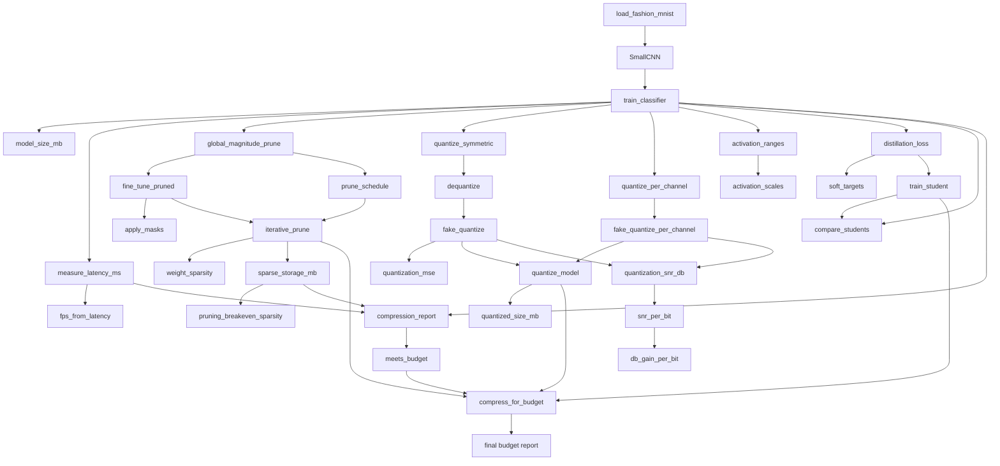
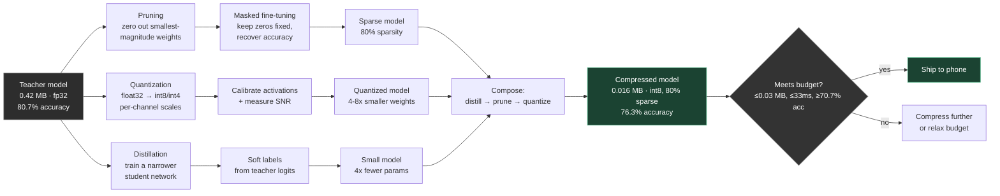

# On-Device Model Compression Pipeline

> "A 150 MB model runs at 200 ms/frame. You need 30 FPS on a phone. What do you change?"

A from-scratch PyTorch implementation of the three levers used to answer that
question in practice — **pruning**, **quantization**, and **knowledge
distillation** — measured end to end on a real CNN trained on Fashion-MNIST,
composed into a single pipeline that stops as soon as a size/latency/accuracy
budget is met.

## Architecture

The single entry point `scaffold.py` calls `main()`, which walks the same
five-part pipeline built in `model.py`, step by step.



Five stages, each building on the last:

1. **Baseline** — load real Fashion-MNIST, train a teacher `SmallCNN`, measure
   size and latency
2. **Pruning** — global magnitude pruning with masked fine-tuning on a cubic
   sparsity schedule, plus the sparse-storage break-even math
3. **Quantization** — symmetric and per-channel int-N weight quantization,
   calibrated activation ranges, measured SNR per bit width
4. **Distillation** — a narrower student trained on the teacher's soft labels,
   compared against the same student trained on hard labels alone
5. **The pipeline** — `compress_for_budget` composes all three levers,
   scoring each stage against the budget and stopping at the first pass

## How compression works

Conceptually, each lever attacks a different part of what makes a model
expensive: how *many* parameters it has, how many *bits* each one costs, and
how *wide* the architecture is.



Pruning shrinks *parameter count* (but only pays off in storage once sparsity
clears the break-even point for your index format). Quantization shrinks
*bits per parameter* (at the cost of precision — SNR drops ~6 dB per bit
removed). Distillation shrinks the *architecture itself* by training a
smaller network to mimic the larger one's soft output distribution, not
just its hard labels. None of them alone gets you to budget here —
composing all three does.

## Results

Teacher CNN: 105,866 params, 0.42 MB (fp32), 80.7% accuracy.

Budget: ≤ 0.03 MB, ≤ 33.3 ms/frame (30 FPS), ≥ 70.7% accuracy.

| Stage     | Size (MB) | Latency (ms) | Accuracy | Sparsity | Budget met |
|-----------|----------:|-------------:|---------:|---------:|:----------:|
| teacher   | 0.4235    | 0.316         | 0.807    | 0.00     | ✗ |
| distilled | 0.1068    | 0.245         | 0.753    | 0.00     | ✗ |
| pruned    | 0.0322    | 0.249         | 0.762    | 0.80     | ✗ |
| quantized | 0.0160    | 0.248         | 0.763    | 0.80     | ✓ |

**Budget met at the `quantized` stage** — distill for a smaller architecture,
prune what's left, quantize what survives. Each lever attacks a different
bottleneck; composing them is what actually closes a 26x size gap.

*(Latency is measured on CPU in this environment, so absolute numbers won't
match a phone — but the relative story per stage, and the methodology for
measuring it, transfers directly.)*

## What each lever bought

**Pruning** — global magnitude pruning, masked fine-tuning, cubic sparsity
schedule:
- One-shot pruning to 90% sparsity: accuracy collapses to 58.6%
- The same target reached iteratively (schedule `[0.633, 0.867, 0.9]`) with
  fine-tuning between rounds: 81.9% — *above* the original teacher
- Sparse storage only pays off past ~33% sparsity at 16-bit indices — a
  90%-sparse tensor stored densely is still full size; this is the
  "zeros still cost bytes" trap naive pruning walks into

**Quantization** — symmetric and per-channel, calibrated activation ranges,
measured SNR:
- 8-bit and 4-bit per-channel: accuracy holds (80.9%, 81.4%)
- 2-bit: falls off a cliff (26.6%)
- fc1 SNR drops 41.2 dB → 16.0 dB → 1.4 dB across 8/4/2-bit
- Measured gain per bit: 5.99 dB, matching the ~6.02 dB theoretical prediction
  for a uniform quantizer

**Distillation** — soft-label training into a narrower student (8, 16, 32):
- Distilled: 75.3% vs. plain hard-label training: 74.0% (+1.3 pts)
- Modest at this data/model scale, but consistent and in the right direction

## Project structure

- `model.py` — every building block: data loading, `SmallCNN`, training,
  pruning, quantization, distillation, measurement, and the composed
  `compress_for_budget` pipeline
- `scaffold.py` — runs the full story end to end and prints the report above

## Running it

```bash
pip install torch numpy
python scaffold.py
```

Downloads Fashion-MNIST (idx files, cached in the system temp dir) on first
run, trains a teacher, and walks through all five stages, printing size,
latency, and accuracy after each.

## Why this exists

Most "model compression" writeups either explain the theory or show a single
before/after number. This project measures every stage of every lever
independently first (so you can see what pruning costs before quantization
even enters the picture), then composes them — which is closer to how the
decision actually gets made in an on-device deployment: given a budget, which
combination of techniques gets you there with the least accuracy lost.
